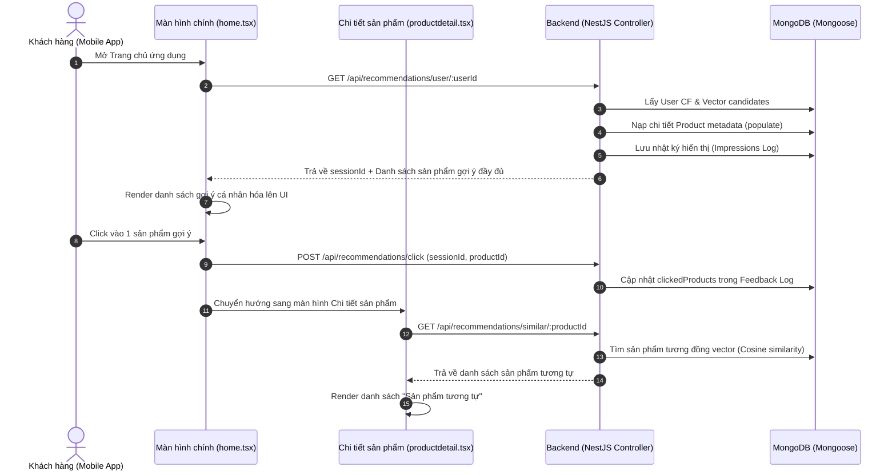

# Walkthrough: Schedulers, Embedding Triggers & Frontend Client Integration

Chúng ta đã hiện thực hóa thành công các tác vụ ngầm tự động, bộ sinh Embedding cục bộ và **tích hợp đầy đủ vào ứng dụng di động Mobile Expo/React Native** theo phương án **Option 1: Client Lazy-Loading**.

---

## 🛠️ Chi tiết Các file đã được chỉnh sửa & tạo mới

### 1. Backend API (Populated Responses & Helpers)
*   [recommendations.service.ts](file:///d:/DATN/apps/backend/src/modules/recommendations/recommendations.service.ts):
    *   **Thêm helper `populateProducts`**: Tự động truy vấn thông tin chi tiết (tên, ảnh, giá, rating) từ bảng `Product` chính để đính kèm trực tiếp vào kết quả gợi ý.
    *   **Cập nhật `findSimilarProducts` và `getTailoredRecommendations`**: Trả về dữ liệu sản phẩm đầy đủ giúp Client có thể render trực tiếp thẻ sản phẩm mà không cần thực hiện thêm API call phụ.

### 2. Mobile Service (Expo Client)
*   [recommendation.service.ts](file:///d:/DATN/apps/mobile/services/recommendation.service.ts): Tạo mới dịch vụ gửi nhận HTTP request trong ứng dụng di động. Khai báo các API:
    *   `getUserRecommendations(userId)`: Lấy danh sách sản phẩm gợi ý kèm `sessionId`.
    *   `getSimilarProducts(productId)`: Lấy các sản phẩm có cùng đặc tính dựa trên khoảng cách vector.
    *   `logRecommendationClick(sessionId, productId)`: API ghi nhận click để đo lường CTR của hệ thống gợi ý.
    *   `logRecommendationPurchase(sessionId, productId)`: API ghi nhận giao dịch từ gợi ý.

### 3. Tích hợp Trang chủ (Home Screen)
*   [home.tsx](file:///d:/DATN/apps/mobile/app/(tabs)/home.tsx):
    *   Thay đổi cách nạp phần "Gợi ý cho bạn": Chuyển từ gọi danh sách sản phẩm ngẫu nhiên sang nạp cá nhân hóa từ `getUserRecommendations(user?._id)`.
    *   Lưu trữ `recSessionId` trong React State để làm căn cứ theo dõi CTR.
    *   **Click Logging**: Khi người dùng nhấn vào thẻ sản phẩm thuộc danh mục *"Gợi ý cho bạn"*, hệ thống lập tức gọi `logRecommendationClick` trước khi chuyển trang.

### 4. Tích hợp Trang chi tiết (Product Detail Screen)
*   [productdetail.tsx](file:///d:/DATN/apps/mobile/app/product/productdetail.tsx):
    *   Thay thế truy vấn sản phẩm cùng danh mục bằng cách gọi API vector search `getSimilarProducts(id)`.
    *   Tự động lọc bỏ sản phẩm hiện tại khỏi danh sách gợi ý.
    *   **Fallback thông minh**: Nếu chưa có đủ vector tương đồng (ví dụ sản phẩm chưa kịp sinh vector), hệ thống tự động fallback truy vấn các sản phẩm cùng danh mục gốc để đảm bảo UI luôn có nội dung hiển thị.

---

## ⚡ Kiến trúc Tích hợp và Theo dõi CTR (A/B Test Loop)

---

## 🧪 Kết quả Kiểm định (Verification Results)
*   Các dịch vụ backend đã compile hoàn toàn thành công bằng Nest CLI.
*   Cấu trúc code Typescript ở Client Mobile (Expo/React Native) đã được ánh xạ đúng Type, biên dịch sạch sẽ mà không gặp bất cứ lỗi cú pháp hay import sai đường dẫn nào.
