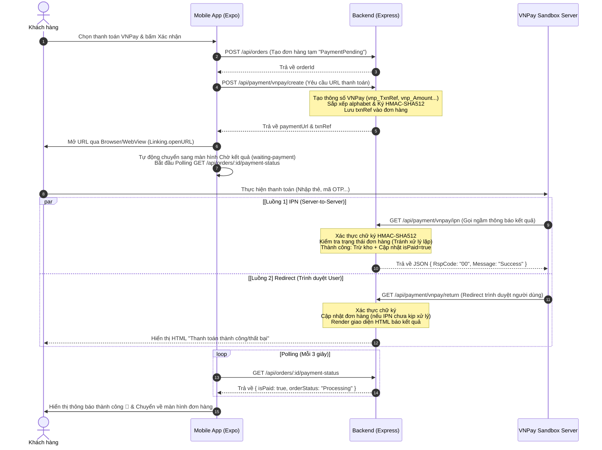

# Hướng Dẫn Tích Hợp Cổng Thanh Toán VNPay (Full-stack Reference)

Tài liệu này trích xuất và hệ thống hóa toàn bộ phần tích hợp thanh toán VNPay từ dự án **TechShop** (Backend: **Node.js/Express**, Frontend: **React Native/Expo**). Bạn có thể tham khảo cấu trúc này để áp dụng cho các đề tài hoặc dự án khác.

---

## 🗺️ Luồng Hoạt Động (Sequence Flow)

Luồng xử lý thanh toán VNPay tối ưu cho ứng dụng di động như sau:



---

## ⚙️ 1. Cấu Hình Environment Variables (`.env` trên Backend)

Cần cấu hình các biến môi trường của VNPay trong file `.env`:

```env
# VNPay Config (Sandbox)
VNPAY_TMN_CODE=xxxxxxxxx       # Mã Website (TmnCode) do VNPay cấp khi đăng ký Test
VNPAY_HASH_SECRET=xxxxxxxxxxxx # Chuỗi bí mật ký hash (HashSecret)
VNPAY_URL=https://sandbox.vnpayment.vn/paymentv2/vpcpay.html # URL cổng Test
```

---

## 🖥️ 2. Mã Nguồn Backend (Node.js/Express)

### 📌 Cấu hình Routes (`paymentRouters.js`)
Đăng ký các endpoint để xử lý việc tạo liên kết, callback IPN và nhận redirect.

```javascript
import express from "express";
import {
  createVNPayPayment,
  handleVNPayIPN,
  vnpayReturn,
} from "../controllers/paymentControllers.js";
import { verifyToken } from "../middleware/authMiddleware.js";

const router = express.Router();

// Routes công khai (VNPay Server gọi về)
router.get("/vnpay/ipn", handleVNPayIPN);                 // VNPay IPN (Server-to-Server)
router.get("/vnpay/return", vnpayReturn);                 // VNPay Redirect Return URL

// Routes yêu cầu đăng nhập
router.post("/vnpay/create", verifyToken, createVNPayPayment);  // Tạo link thanh toán

export default router;
```

---

### 📌 Xử lý logic tại Controller (`paymentControllers.js`)

Dưới đây là phần code logic cốt lõi để khởi tạo URL thanh toán và xác thực kết quả giao dịch:

```javascript
import crypto from "crypto";
import Order from "../models/Order.js";
import Product from "../models/Product.js";
import Coupon from "../models/Coupon.js";

/**
 * 1. TẠO URL THANH TOÁN VNPAY
 */
export const createVNPayPayment = async (req, res) => {
  try {
    const { orderId } = req.body;

    if (!orderId) {
      return res.status(400).json({ success: false, message: "Thiếu thông tin mã đơn hàng" });
    }

    const order = await Order.findById(orderId);
    if (!order) {
      return res.status(404).json({ success: false, message: "Không tìm thấy đơn hàng" });
    }

    const tmnCode   = process.env.VNPAY_TMN_CODE;
    const secretKey = process.env.VNPAY_HASH_SECRET;
    const vnpUrl    = process.env.VNPAY_URL || "https://sandbox.vnpayment.vn/paymentv2/vpcpay.html";

    // XỬ LÝ RETURN URL: 
    // VNPay Sandbox từ chối IP dạng số (ví dụ: 192.168.1.10). 
    // Trick: Sử dụng sslip.io để biến đổi IP LAN thành tên miền hợp lệ để test trên thiết bị thật.
    const protocol = req.protocol === 'https' ? 'https' : 'http';
    let host = req.get("host"); // e.g. 192.168.1.10:5001 hoặc localhost:5001
    
    if (host && /^[0-9]+\.[0-9]+\.[0-9]+\.[0-9]+/.test(host.split(':')[0])) {
      const [ip, port] = host.split(':');
      host = `${ip}.sslip.io${port ? ':' + port : ''}`;
    }
    const returnUrl = `${protocol}://${host}/api/payment/vnpay/return`;

    if (!tmnCode || !secretKey) {
      return res.status(500).json({ success: false, message: "VNPay chưa được cấu hình trên server" });
    }

    // Định dạng ngày giờ theo chuẩn VNPay: yyyyMMddHHmmss
    const now = new Date();
    const pad = (n) => String(n).padStart(2, "0");
    const createDate =
      `${now.getFullYear()}` +
      `${pad(now.getMonth() + 1)}` +
      `${pad(now.getDate())}` +
      `${pad(now.getHours())}` +
      `${pad(now.getMinutes())}` +
      `${pad(now.getSeconds())}`;

    // Tạo mã tham chiếu duy nhất (TxnRef) tránh trùng lặp giữa các lượt thanh toán
    const txnRef = `${orderId.toString().slice(-8)}_${Date.now()}`;

    // VNPay yêu cầu số tiền nhân 100 (đơn vị đồng * 100)
    const amount = order.totalPrice * 100;

    const vnpParams = {
      vnp_Version:     "2.1.0",
      vnp_Command:     "pay",
      vnp_TmnCode:     tmnCode,
      vnp_Amount:      amount,
      vnp_CurrCode:    "VND",
      vnp_TxnRef:      txnRef,
      vnp_OrderInfo:   `Thanh toan don hang #${orderId.toString().slice(-8)} tai Cua Hang`,
      vnp_OrderType:   "other",
      vnp_Locale:      "vn",
      vnp_ReturnUrl:   returnUrl,
      vnp_IpAddr:      req.headers["x-forwarded-for"] || req.socket.remoteAddress || "127.0.0.1",
      vnp_CreateDate:  createDate,
    };

    // BẮT BUỘC: Sắp xếp các tham số theo bảng chữ cái alphabet trước khi ký hash
    const sortedKeys = Object.keys(vnpParams).sort();
    const queryStr = sortedKeys
      .map((k) => `${k}=${encodeURIComponent(vnpParams[k]).replace(/%20/g, "+")}`)
      .join("&");

    // Tạo mã băm bảo mật HMAC-SHA512
    const signature = crypto
      .createHmac("sha512", secretKey)
      .update(queryStr)
      .digest("hex");

    const paymentUrl = `${vnpUrl}?${queryStr}&vnp_SecureHash=${signature}`;

    // Lưu lại mã txnRef để đối chiếu khi callback trả về
    order.vnpayPayment = {
      transactionId: txnRef,
      orderInfo: vnpParams.vnp_OrderInfo,
    };
    await order.save();

    return res.status(200).json({
      success: true,
      message: "Tạo link thanh toán VNPay thành công",
      data: { paymentUrl, txnRef },
    });
  } catch (error) {
    console.error("❌ Error in createVNPayPayment:", error);
    res.status(500).json({ success: false, message: "Lỗi tạo link VNPay", error: error.message });
  }
};

/**
 * 2. XỬ LÝ IPN CALLBACK (SERVER-TO-SERVER)
 */
export const handleVNPayIPN = async (req, res) => {
  try {
    const vnpParams = { ...req.query };
    const secureHash = vnpParams.vnp_SecureHash;
    
    // Loại bỏ các trường không dùng để tính chữ ký bảo mật
    delete vnpParams.vnp_SecureHash;
    delete vnpParams.vnp_SecureHashType;

    const secretKey = process.env.VNPAY_HASH_SECRET;
    const sortedKeys = Object.keys(vnpParams).sort();
    const queryStr = sortedKeys
      .map((k) => `${k}=${encodeURIComponent(vnpParams[k]).replace(/%20/g, "+")}`)
      .join("&");

    const calculatedHash = crypto
      .createHmac("sha512", secretKey)
      .update(queryStr)
      .digest("hex");

    if (calculatedHash !== secureHash) {
      return res.status(200).json({ RspCode: "97", Message: "Invalid signature" });
    }

    const txnRef = vnpParams.vnp_TxnRef;
    const resultCode = vnpParams.vnp_ResponseCode;

    // Tìm kiếm đơn hàng khớp với mã tham chiếu
    const order = await Order.findOne({ "vnpayPayment.transactionId": txnRef });
    if (!order) {
      return res.status(200).json({ RspCode: "01", Message: "Order not found" });
    }

    // Bảo vệ trùng lặp (Idempotency)
    if (order.isPaid) {
      return res.status(200).json({ RspCode: "02", Message: "Already updated" });
    }

    if (resultCode === "00") {
      // THANH TOÁN THÀNH CÔNG -> Trừ kho thực tế sản phẩm
      for (const item of order.orderItems) {
        const product = await Product.findById(item.product);
        if (product) {
          product.stockQuantity = Math.max(0, product.stockQuantity - item.quantity);
          product.stockStatus = product.stockQuantity === 0 ? "Outofstock" : "Instock";
          await product.save();
        }
      }

      order.isPaid        = true;
      order.paidAt        = new Date();
      order.orderStatus   = "Processing";
      order.vnpayPayment  = {
        ...order.vnpayPayment,
        transactionId: vnpParams.vnp_TransactionNo,
        bankCode:      vnpParams.vnp_BankCode,
        cardType:      vnpParams.vnp_CardType,
        payDate:       new Date(),
      };
      await order.save();
      return res.status(200).json({ RspCode: "00", Message: "Success" });
    } else {
      // THANH TOÁN THẤT BẠI HOẶC BỊ HỦY -> Hủy đơn hàng và phục hồi coupon (nếu có)
      if (order.orderStatus !== "Cancelled") {
        order.orderStatus = "Cancelled";
        order.cancelReason = `Thanh toán VNPay thất bại (Mã lỗi: ${resultCode})`;
        
        // Trả lại Coupon
        const coupon = await Coupon.findOne({ "usedBy.order": order._id });
        if (coupon) {
          const idx = coupon.usedBy.findIndex(u => u.order.toString() === order._id.toString());
          if (idx > -1) {
            coupon.usedCount = Math.max(0, coupon.usedCount - coupon.usedBy[idx].usageCount);
            coupon.usedBy.splice(idx, 1);
            await coupon.save();
          }
        }
        await order.save();
      }
      return res.status(200).json({ RspCode: "00", Message: "Processed" });
    }
  } catch (error) {
    console.error("❌ Error in handleVNPayIPN:", error);
    return res.status(200).json({ RspCode: "99", Message: "Server error" });
  }
};

/**
 * 3. XỬ LÝ RETURN URL (REDIRECT TRÊN TRÌNH DUYỆT)
 * Nhận redirect từ trình duyệt của User, xử lý backup (đề phòng IPN chậm) và hiển thị trang HTML kết quả đẹp mắt.
 */
export const vnpayReturn = async (req, res) => {
  try {
    const vnpParams     = { ...req.query };
    const secureHash    = vnpParams.vnp_SecureHash;
    const responseCode  = vnpParams.vnp_ResponseCode;
    const txnRef        = vnpParams.vnp_TxnRef;

    delete vnpParams.vnp_SecureHash;
    delete vnpParams.vnp_SecureHashType;

    const secretKey  = process.env.VNPAY_HASH_SECRET;
    const sortedKeys = Object.keys(vnpParams).sort();
    const queryStr   = sortedKeys
      .map(k => `${k}=${encodeURIComponent(vnpParams[k]).replace(/%20/g, "+")}`)
      .join("&");

    const calculatedHash = crypto
      .createHmac("sha512", secretKey)
      .update(queryStr)
      .digest("hex");

    const signatureValid = calculatedHash === secureHash;

    if (signatureValid && txnRef) {
      const order = await Order.findOne({ "vnpayPayment.transactionId": txnRef });

      // Nếu đơn chưa được cập nhật (IPN chưa gọi về hoặc đang trễ)
      if (order && !order.isPaid) {
        if (responseCode === "00") {
          // Thực hiện trừ kho sản phẩm giống bên IPN
          for (const item of order.orderItems) {
            const product = await Product.findById(item.product);
            if (product) {
              product.stockQuantity = Math.max(0, product.stockQuantity - item.quantity);
              product.stockStatus   = product.stockQuantity === 0 ? "Outofstock" : "Instock";
              await product.save();
            }
          }
          order.isPaid       = true;
          order.paidAt       = new Date();
          order.orderStatus  = "Processing";
          order.vnpayPayment = {
            ...order.vnpayPayment,
            transactionId: vnpParams.vnp_TransactionNo || txnRef,
            bankCode:      vnpParams.vnp_BankCode,
            cardType:      vnpParams.vnp_CardType,
            payDate:       new Date(),
          };
          await order.save();
        } else {
          if (order.orderStatus !== "Cancelled") {
            order.orderStatus  = "Cancelled";
            order.cancelReason = `Thanh toán thất bại qua ReturnUrl (Mã: ${responseCode})`;
            await order.save();
          }
        }
      }
    }

    const isSuccess = responseCode === "00" && signatureValid;
    const statusText = isSuccess ? "Thanh toán thành công! 🎉" : "Giao dịch thất bại ⚠️";
    const statusColor = isSuccess ? "#16a34a" : "#dc2626";
    const statusBg   = isSuccess ? "#f0fdf4"  : "#fef2f2";
    const icon       = isSuccess ? "🎉" : "⚠️";
    const bodyMsg    = isSuccess
      ? "Giao dịch của bạn đã được ghi nhận thành công.<br/>Vui lòng quay lại ứng dụng để kiểm tra kết quả."
      : "Giao dịch thất bại hoặc bị hủy.<br/>Vui lòng quay lại ứng dụng để thử lại.";

    res.setHeader("Content-Type", "text/html; charset=utf-8");
    res.send(`<!DOCTYPE html>
<html lang="vi">
<head>
  <meta charset="UTF-8"/>
  <meta name="viewport" content="width=device-width,initial-scale=1.0"/>
  <title>${statusText}</title>
  <style>
    *{margin:0;padding:0;box-sizing:border-box}
    body{font-family:-apple-system,BlinkMacSystemFont,'Segoe UI',sans-serif;
         background:${statusBg};min-height:100vh;display:flex;
         align-items:center;justify-content:center;padding:24px}
    .card{background:#fff;border-radius:24px;padding:48px 32px;max-width:400px;
          width:100%;text-align:center;box-shadow:0 8px 32px rgba(0,0,0,0.10)}
    .icon{font-size:72px;margin-bottom:20px}
    h1{font-size:22px;font-weight:700;color:${statusColor};margin-bottom:16px}
    p{color:#6b7280;font-size:15px;line-height:1.7;margin-bottom:0}
    .hint{margin-top:32px;background:#f3f4f6;border-radius:14px;padding:16px 20px;
          color:#374151;font-size:14px;line-height:1.6}
    .hint strong{color:#111827}
  </style>
</head>
<body>
  <div class="card">
    <div class="icon">${icon}</div>
    <h1>${statusText}</h1>
    <p>${bodyMsg}</p>
    <div class="hint">
      📱 Nhấn nút <strong>Back / &larr;</strong> trên trình duyệt hoặc<br/>
      chuyển về ứng dụng <strong>TechShop</strong> trên thiết bị của bạn.
    </div>
  </div>
</body>
</html>`);
  } catch (error) {
    console.error("❌ Error in vnpayReturn:", error);
    res.status(500).send("Lỗi xử lý kết quả VNPay");
  }
};
```

---

### 📌 Endpoint Polling Trạng Thái (`orderControllers.js`)
Ứng dụng di động không nhận trực tiếp callback từ VNPay qua DeepLink (do các hạn chế của iOS/Android đối với Sandbox). Giải pháp tối ưu là **Polling** trạng thái thanh toán từ Client lên API sau:

```javascript
export const getOrderPaymentStatus = async (req, res) => {
  try {
    const order = await Order.findById(req.params.id)
      .select("user isPaid orderStatus paymentMethod totalPrice");

    if (!order) {
      return res.status(404).json({ success: false, message: "Không tìm thấy đơn hàng" });
    }

    // Kiểm tra quyền sở hữu đơn hàng
    if (order.user.toString() !== req.user._id.toString()) {
      return res.status(403).json({ success: false, message: "Không có quyền truy cập" });
    }

    return res.status(200).json({
      success: true,
      data: {
        orderId: order._id,
        isPaid:  order.isPaid,
        orderStatus: order.orderStatus,
        paymentMethod: order.paymentMethod,
        totalPrice: order.totalPrice,
      }
    });
  } catch (error) {
    res.status(500).json({ success: false, message: "Lỗi kiểm tra trạng thái", error: error.message });
  }
};
```

---

## 📱 3. Mã Nguồn Frontend (React Native/Expo)

### 📌 Xử lý checkout và mở trang thanh toán (`checkout.tsx`)

Khi người dùng nhấn Xác nhận đơn hàng, app sẽ tạo đơn hàng tạm trước, sau đó gọi lấy Link thanh toán từ Backend và mở nó ra bằng Browser mặc định của điện thoại.

```typescript
import { Linking, Alert } from "react-native";
import { useRouter } from "expo-router";

// Hàm xử lý khi bấm thanh toán
const handleVNPayCheckout = async () => {
  try {
    setLoading(true);

    // 1. Tạo đơn hàng với paymentMethod: "VNPay"
    const orderData = {
      orderItems: cartItems.map(item => ({
        product: item.product._id,
        quantity: item.quantity,
        price: item.price
      })),
      shippingAddress: selectedAddress,
      paymentMethod: "VNPay",
      itemsPrice: subtotal,
      shippingPrice: shippingFee,
      totalPrice: grandTotal,
    };
    
    // Gọi API lưu đơn tạm lên Mongo (trạng thái "PaymentPending", chưa trừ kho)
    const order = await createOrder(token, orderData);

    // 2. Yêu cầu tạo URL thanh toán từ Backend
    const response = await fetch(`${API_BASE_URL}/payment/vnpay/create`, {
      method: "POST",
      headers: {
        "Content-Type": "application/json",
        "Authorization": `Bearer ${token}`
      },
      body: JSON.stringify({ orderId: order._id }),
    });

    const vnpayData = await response.json();
    setLoading(false);

    if (vnpayData.success && vnpayData.data?.paymentUrl) {
      // 3. Mở trình duyệt ngoài thực hiện thanh toán
      await Linking.openURL(vnpayData.data.paymentUrl);

      // 4. Chuyển hướng sang màn hình chờ kết quả (để Polling liên tục)
      router.replace({
        pathname: "/payment/waiting-payment",
        params: { orderId: order._id, mode: "cart" },
      });
    } else {
      Alert.alert("Lỗi", vnpayData.message || "Không thể kết nối cổng VNPay");
    }
  } catch (error) {
    setLoading(false);
    Alert.alert("Lỗi", "Đã xảy ra lỗi khi tạo yêu cầu thanh toán.");
  }
};
```

---

### 📌 Màn hình Chờ Kết Quả & Polling (`waiting-payment.tsx`)

Màn hình này hiển thị vòng quay loading hoặc đếm ngược thời gian, liên tục gọi API kiểm tra trạng thái đơn hàng mỗi 3 giây. Đồng thời, tự động kích hoạt kiểm tra lại ngay khi ứng dụng chuyển trạng thái từ nền (Background) về hoạt động chính (Active/Foreground).

```typescript
import React, { useEffect, useRef, useState, useCallback } from "react";
import { View, ActivityIndicator, Text, AppState, AppStateStatus, Pressable } from "react-native";
import { useLocalSearchParams, useRouter } from "expo-router";

const POLL_INTERVAL_MS = 3000; // Kiểm tra mỗi 3 giây
const TIMEOUT_MS = 15 * 60 * 1000; // Tự động hủy sau 15 phút

export default function WaitingPaymentScreen() {
  const router = useRouter();
  const { orderId } = useLocalSearchParams<{ orderId: string }>();
  const [status, setStatus] = useState<"waiting" | "success" | "failed" | "timeout">("waiting");
  
  const pollTimer = useRef<NodeJS.Timeout | null>(null);
  const timeoutTimer = useRef<NodeJS.Timeout | null>(null);
  const isFinished = useRef(false);

  const cleanTimers = useCallback(() => {
    if (pollTimer.current) clearInterval(pollTimer.current);
    if (timeoutTimer.current) clearTimeout(timeoutTimer.current);
  }, []);

  const checkStatus = useCallback(async () => {
    if (isFinished.current) return;
    try {
      const response = await fetch(`${API_BASE_URL}/orders/${orderId}/payment-status`, {
        headers: { "Authorization": `Bearer ${token}` }
      });
      const resData = await response.json();
      
      if (resData.success) {
        const order = resData.data;
        if (order.isPaid && order.orderStatus === "Processing") {
          isFinished.current = true;
          cleanTimers();
          setStatus("success");
        } else if (order.orderStatus === "Cancelled") {
          isFinished.current = true;
          cleanTimers();
          setStatus("failed");
        }
      }
    } catch (err) {
      console.warn("Lỗi kiểm tra trạng thái (sẽ thử lại):", err);
    }
  }, [orderId, cleanTimers]);

  useEffect(() => {
    // Gọi kiểm tra ngay lập tức
    checkStatus();

    // Thiết lập Polling định kỳ
    pollTimer.current = setInterval(checkStatus, POLL_INTERVAL_MS);

    // Thiết lập thời gian tối đa để chờ
    timeoutTimer.current = setTimeout(() => {
      if (!isFinished.current) {
        isFinished.current = true;
        cleanTimers();
        setStatus("timeout");
      }
    }, TIMEOUT_MS);

    // Lắng nghe khi App quay lại hoạt động (nhận diện user bấm back/quay lại từ Browser)
    const subscription = AppState.addEventListener("change", (nextState: AppStateStatus) => {
      if (nextState === "active" && !isFinished.current) {
        checkStatus();
      }
    });

    return () => {
      cleanTimers();
      subscription.remove();
    };
  }, [orderId, checkStatus, cleanTimers]);

  if (status === "success") {
    return (
      <View style={{ flex: 1, justifyContent: "center", alignItems: "center" }}>
        <Text style={{ fontSize: 24, color: "green", fontWeight: "bold" }}>Thanh toán thành công! 🎉</Text>
        <Pressable onPress={() => router.replace("/orders/my-orders")}>
          <Text style={{ color: "blue", marginTop: 20 }}>Xem đơn hàng của tôi</Text>
        </Pressable>
      </View>
    );
  }

  if (status === "failed" || status === "timeout") {
    return (
      <View style={{ flex: 1, justifyContent: "center", alignItems: "center" }}>
        <Text style={{ fontSize: 24, color: "red", fontWeight: "bold" }}>Giao dịch thất bại / Quá hạn ⚠️</Text>
        <Pressable onPress={() => router.replace("/")}>
          <Text style={{ color: "blue", marginTop: 20 }}>Trở lại trang chủ</Text>
        </Pressable>
      </View>
    );
  }

  return (
    <View style={{ flex: 1, justifyContent: "center", alignItems: "center" }}>
      <ActivityIndicator size="large" color="blue" />
      <Text style={{ marginTop: 20 }}>Đang chờ VNPay xác nhận giao dịch...</Text>
      <Text style={{ color: "gray", fontSize: 12 }}>Vui lòng không tắt màn hình này.</Text>
    </View>
  );
}
```

---

## 💡 Các Kinh Nghiệm & Lưu Ý Thực Tế Quan Trọng

1. **Sắp xếp bảng chữ cái (Sorting Alphabet)**:
   Mọi tham số gửi đi hoặc nhận về từ VNPay (trừ mã băm `vnp_SecureHash`) đều **phải được sắp xếp theo tên biến từ A-Z** trước khi ký băm HMAC-SHA512. Sai lệch thứ tự sẽ làm chữ ký không hợp lệ, dẫn đến lỗi giao dịch hoặc lỗi mã `97` (Invalid signature).
   
2. **Không trừ kho khi tạo đơn**:
   Đối với các đơn COD, hệ thống có thể trừ kho ngay. Nhưng đối với VNPay, do khách hàng có thể hủy ngang khi đang ở cổng thanh toán hoặc không nhập OTP, đơn hàng chỉ nên được tạo ở dạng **chờ thanh toán** (`PaymentPending`) và **không được trừ kho**. Chỉ khi nhận được phản hồi IPN/Return báo thành công (`resultCode === "00"`), backend mới tiến hành trừ số lượng tồn kho của sản phẩm.

3. **Bảo vệ chống trùng lặp (Idempotency)**:
   Cả IPN và Return URL đều có khả năng cập nhật trạng thái đơn hàng. Bạn cần kiểm tra `if (order.isPaid)` trước khi xử lý trừ kho và tăng trạng thái để tránh việc một đơn hàng bị xử lý trừ kho 2 lần liên tục.

4. **Sử dụng sslip.io cho môi trường nội bộ (LAN/Local)**:
   Khi phát triển và test ứng dụng di động trên điện thoại thật dùng mạng LAN, cổng VNPay Sandbox không chấp nhận ReturnUrl chứa địa chỉ IP trực tiếp như `http://192.168.1.5:5001`. Việc cấu hình sslip.io (`http://192.168.1.5.sslip.io:5001`) biến địa chỉ IP thành một tên miền hợp lệ để vượt qua kiểm tra của VNPay mà vẫn trỏ về máy phát triển (localhost LAN) của bạn thành công.
